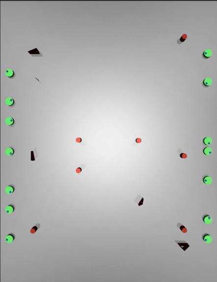
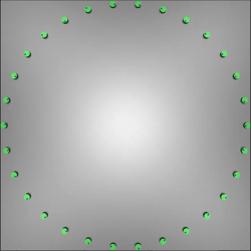
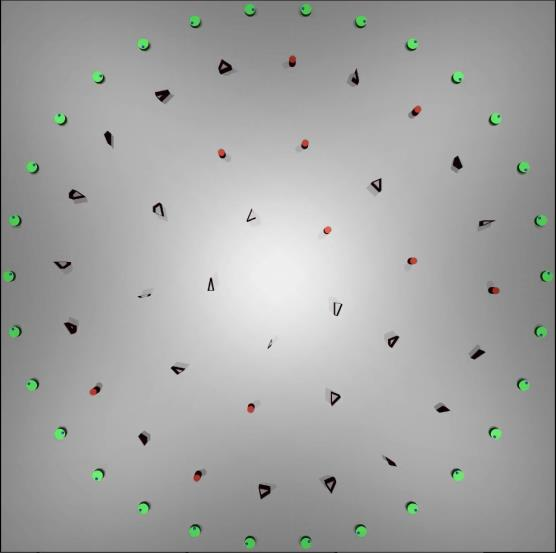
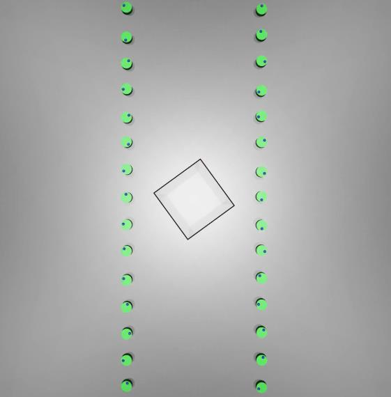

# Distributed Multi-Robot Navigation with Deep Reinforcement Learning (RVO-SAC)

An open-source implementation of a high-performance, fully distributed multi-robot collision avoidance algorithm using deep reinforcement learning, designed for scalability and deployment in complex, dense environments.

> [!NOTE]
> For the most comprehensive and authoritative information, please refer to the original bachelor's thesis upon which this project is based: "[190320321_吴新裕_梅杰_基于强化学习的多移动机器人分布式避障导航.pdf](https://github.com/XinyuWuu/FinalProject/blob/master/190320321_%E5%90%B4%E6%96%B0%E8%A3%95_%E6%A2%85%E6%9D%B0_%E5%9F%BA%E4%BA%8E%E5%BC%BA%E5%8C%96%E5%AD%A6%E4%B9%A0%E7%9A%84%E5%A4%9A%E7%A7%BB%E5%8A%A8%E6%9C%BA%E5%99%A8%E4%BA%BA%E5%88%86%E5%B8%83%E5%BC%8F%E9%81%BF%E9%9A%9C%E5%AF%BC%E8%88%AA.pdf)"

https://github.com/user-attachments/assets/df23ba7d-8a0e-4d1d-9cc8-7967ab54ccda

https://github.com/user-attachments/assets/98f9ae7b-e4cb-428f-9c99-139eb6f85e56

https://github.com/user-attachments/assets/11cd1217-ca04-4c2c-9a4f-416ec8b1d5ba

https://github.com/user-attachments/assets/82029d69-f688-4a07-b06d-7e701cb44918

https://github.com/user-attachments/assets/6b724c3c-ed64-425a-b6e8-e5cc1a463a3d

## Core Features

This project presents a novel framework for multi-robot navigation that achieves state-of-the-art performance through a combination of intelligent design choices. It is built to be robust, efficient, and scalable for real-world applications.

  * **Advanced Obstacle Representation (RVOp)**: The system utilizes a novel **Reciprocal Velocity Obstacle Plus (RVOp)** encoding scheme. This method enhances the traditional Reciprocal Velocity Obstacle (RVO) by incorporating richer information about the shapes of static obstacles and the intentions of other agents. This allows for more nuanced, predictive, and ultimately safer navigation in environments with both static and dynamic obstacles.

  * **High-Fidelity Physics Simulation**: The control policy is trained within the **MuJoCo** physics engine, a departure from the simple first-order integrators used in many related works. This approach forces the learning algorithm to discover strategies that are inherently robust to real-world physical phenomena like momentum, friction, contact forces, and control signal delays. The resulting policy demonstrates superior planning capabilities and is better suited for direct sim-to-real transfer.

  * **Efficient Off-Policy Reinforcement Learning (SAC)**: The core learning algorithm is **Soft Actor-Critic (SAC)**, a modern, off-policy reinforcement learning method. Compared to the on-policy algorithms like PPO that are common in this domain, SAC offers significantly greater sample efficiency and training stability. This is achieved by using a replay buffer, which allows the agent to learn from past experiences multiple times, a critical advantage in computationally expensive multi-agent simulations.

  * **Lightweight & Scalable Architecture**: The algorithm is fully distributed, meaning each robot makes independent decisions based only on its local observations. This design eliminates the communication and computational bottlenecks of centralized systems, allowing for seamless scaling to large numbers of robots. The policy network itself is a simple yet powerful Multi-Layer Perceptron (MLP) with only 3.3 million parameters, making it computationally inexpensive and suitable for deployment on resource-constrained hardware, such as the small onboard computers found on mobile robots.

  * **State-of-the-Art Performance**: The framework has been rigorously tested and demonstrates superior performance compared to four other leading algorithms in the field: RL-RVO, SARL, GA3C-CADRL, and the non-learning method NH-ORCA. In direct comparisons, this algorithm achieves near-perfect success rates in more complex and crowded scenarios where other methods experience significant performance degradation or failure.

The design philosophy of this project addresses a critical gap between academic research and practical industrial deployment. Many robotics projects pair complex neural networks with simplistic simulators, leading to policies that perform well in simulation but fail in the real world. This work adopts the opposite, more effective strategy: a complex, high-fidelity simulator (MuJoCo) is used to train a simple, efficient network (MLP). The use of MuJoCo ensures that the learned policy is fundamentally robust and accounts for the complex dynamics of the physical world, tackling the difficult "sim-to-real" challenge at the training stage. Simultaneously, the lightweight nature of the MLP ensures that this robust policy can be executed efficiently on real, often low-power, robotic hardware, making the solution both powerful and practical.

## Research Context and Citation

This repository contains the official source code for the research detailed in the bachelor's thesis by Xinyu Wu at Harbin Institute of Technology. If you use this work in your research, please cite the original thesis.

```bibtex
@mastersthesis{Wu2023,
author = {Xinyu Wu (吴新裕)},
title = {Reinforcement Learning based Distributed Multi-Robot Navigation with Collision Avoidance (基于强化学习的多移动机器人分布式避障导航)},
school = {Harbin Institute of Technology, Shenzhen},
year = {2023},
note = {Supervisor: Prof. Jie Mei (梅杰)},
url = {https://github.com/XinyuWuu/RL-RVOp/}
}
```

## Technical Deep Dive: The RVO-SAC Framework

The RVO-SAC framework is a comprehensive solution for multi-robot navigation, built on a solid theoretical foundation and featuring several key technical innovations.

### Problem Formulation (Dec-POMDP)

The task of coordinating multiple robots in a shared space is formally modeled as a **Decentralized Partially Observable Markov Decision Process (Dec-POMDP)**. This is a standard but powerful formalism for multi-agent systems where each agent has an incomplete view of the total system state.

In this framework:
*   The system consists of a set of agents (robots) $D = \{1, 2,..., n\}$.
*   Each agent $i$ has access to a **local observation** $o_i$, which includes its own state and information about nearby obstacles and other agents. It does not have access to the full global state $s$.
*   The goal for each agent is to learn a **policy** $\pi(a_i | o_i)$ that maps its local observation to an action $a_i$. In this project, the action is a continuous 2D velocity command.
*   The objective is to find a policy that maximizes the expected sum of discounted future rewards for all agents, leading to efficient and collision-free navigation to their respective goals.

### State & Environment Representation

The effectiveness of any learning-based system hinges on how it perceives and represents its environment. This framework employs a carefully designed, rotationally-invariant encoding scheme.

#### Self-State ($O_{self}$)

Each robot's internal state is encoded in its own local coordinate frame to ensure the learned policy is generalizable regardless of the robot's orientation in the world. The self-state vector $O_{self}$ is a four-dimensional float array :

$O_{self} =$

*   $𝑡𝑎𝑟𝑔$: The 2D vector pointing from the robot's current position to its goal, expressed in the robot's local coordinate frame.
*   $v$: The robot's current linear velocity.
*   $\omega$: The robot's current angular velocity.

#### Surroundings ($O_{sur}$) with Reciprocal Velocity Obstacle Plus (RVOp)

The representation of the external world is a key innovation of this project. Instead of raw sensor data, a structured, information-rich encoding called **Reciprocal Velocity Obstacle Plus (RVOp)** is used. RVOp is an eight-dimensional vector that extends the standard RVO concept.

The standard RVO method is highly effective for negotiating with other moving agents by reasoning about their relative velocities. However, it is less descriptive when dealing with static, geometrically complex obstacles like walls. This framework enhances RVO by adding a crucial component: the vector $v_n$, which points from the agent to the nearest point on a static obstacle's contour. This vector explicitly encodes the distance and direction to the most immediate static threat, allowing the agent to learn more effective avoidance maneuvers for non-agent obstacles. This makes the policy robust in realistic, hybrid environments containing both dynamic agents and static structures.

To process all external entities—both other robots and static obstacles—in a consistent manner, a **unified encoding** $O_{sur}$ is employed. This is a ten-dimensional vector:

$O_{sur} =$

*   $RVOp$: The 8D vector describing the geometric and velocity-based relationship to the external entity.
*   $O_{targ}$: A 2D vector representing the entity's "intent." For another robot, this is its target goal vector. For a static obstacle, this is simply a zero vector.

This unified encoding is a critical design choice for computational efficiency. Many multi-agent systems use complex, heterogeneous network architectures to process different types of sensor data (e.g., a CNN for lidar scans of static obstacles, an RNN for dynamic agent data). Such architectures add significant complexity and overhead. By creating a single, uniform $O_{sur}$ vector for all external entities, this framework can use one simple, homogeneous MLP network. This elegant solution is a primary reason for the algorithm's low computational footprint and high efficiency.

### Velocity-Centric Reward Function

The reward function is the heart of the reinforcement learning process, as it provides the feedback signal that guides the agent's behavior. The function used in this work is meticulously designed to provide a dense, continuous, and highly informative learning signal by focusing on the agent's chosen **velocity command**.

Many RL approaches suffer from sparse rewards (e.g., a reward only upon reaching the goal), which makes learning difficult. This framework's reward function provides immediate, graded feedback on every action. Five of the six reward components are calculated using dot products involving the agent's chosen velocity vector $v$. This gives the agent continuous feedback on how its action contributes to various sub-goals: moving towards the target, avoiding collisions, and maintaining safe distances. This dense reward signal is a primary driver of the stable and efficient training process observed in the results.

The total reward $r_{all}$ is the sum of the following components :

| Component | Formula | Purpose |
| :--- | :--- | :--- |
| **Time Penalty** | $r_{time} = t_{b} < 0$ | A small negative reward at each timestep to encourage reaching the goal quickly. |
| **Target Reward** | $r_{targ} = a \frac{v \cdot v_{targ}}{v_{max}\|v_{targ}\|}$ | Rewards velocity components that are aligned with the direction to the target. |
| **Obstacle Collision Penalty** | $r_{colo} = -b \frac{v \cdot v_{n}}{v_{max}\|v_{n}\|} - c$ | A large penalty for choosing a velocity that points into a static obstacle at the moment of collision. |
| **Robot Collision Penalty** | $r_{colr} = -d \frac{(v_{1} - v_{2}) \cdot v'}{v_{max}\|v'\|} - f$ | A large penalty based on the relative velocity between two colliding robots. |
| **Obstacle Proximity Penalty** | $r_{nearo} = -g (\frac{v \cdot v_{n}}{v_{max}\|v_{n}\|} + 1) e^{-\frac{\|v_{n}\|}{\eta R}}$ | An exponentially decaying penalty that creates a smooth, repulsive "force field" to discourage getting too close to static obstacles. |
| **Robot Proximity Penalty** | $r_{nearr} = -h (\frac{(v_{1} - v_{2}) \cdot v'}{v_{max}\|v'\|} + 2) e^{-\frac{\|v_{n}\|}{\mu R}}$ | A similar repulsive field to maintain a safe, socially-aware distance from other robots. |

### Network Architecture and Algorithm

The policy is learned using the Soft Actor-Critic (SAC) algorithm. The network architecture is a simple Multi-Layer Perceptron (MLP), deliberately chosen for its computational efficiency over more complex recurrent structures like GRUs or LSTMs.

*   **Network Input**: The input to the MLP is a single flattened vector. It consists of the agent's own state $O_{self}$ concatenated with a fixed number ($O_{max}$) of $O_{sur}$ vectors representing the nearest neighbors. The neighbors are sorted by distance, and if fewer than $O_{max}$ are visible, the input is padded with a special value.
*   **Algorithm (SAC)**: Soft Actor-Critic is an off-policy, maximum entropy deep reinforcement learning algorithm. Its off-policy nature allows it to use a replay buffer, where past experiences are stored and reused for multiple training updates. This dramatically improves sample efficiency, which is crucial for multi-agent systems where generating simulation data is computationally expensive. The maximum entropy formulation encourages exploration by rewarding policies that are as random as possible while still succeeding at the task, leading to more robust and generalizable behaviors.

## Performance and Benchmarking

The RVO-SAC framework was rigorously evaluated across a wide range of scenarios, demonstrating exceptional performance and robustness. All results are averaged over 100 random trials.

### Quantitative Results

The algorithm was tested on 15 distinct scenarios, categorized as **Training**, **Control** (similar to training but with unseen obstacle shapes), and **Difference** (novel structures and much higher agent/obstacle density). The performance remained consistently high across all categories, showcasing strong generalization.

| Scenario Type | Avg. Success Rate | Avg. Arrival Rate | Avg. Speed (m/s) | Avg. Extra Distance |
| :--- | :--- | :--- | :--- | :--- |
| **Training (5 scenarios)** | 99.06% | 99.91% | 0.867 | 1.088 |
| **Control (5 scenarios)** | 98.83% | 99.80% | 0.867 | 1.124 |
| **Difference (5 scenarios)**| 99.53% | 99.81% | 0.841 | 1.073 |

*   **Success Rate**: Percentage of robots that reach their goal within the time limit without any collisions.
*   **Arrival Rate**: Percentage of robots that reach their goal, even if they had a temporary collision.
*   **Average Speed**: The average speed of successful robots (max speed is 1.0 m/s).
*   **Extra Distance**: Ratio of the actual path length to the direct straight-line distance. A value close to 1.0 indicates high efficiency.

### Qualitative Results (Visual Gallery)

The following scenarios highlight the algorithm's capabilities in diverse and challenging situations.

| Scene 2-1 (Line Swap) | Scene 6-0 (30-Robot Circle) | Scene 6-2 (Dense Obstacles) | Scene 6-4 (Spin Pattern) |
| :---: | :---: | :---: | :---: |
|  |  |  |  |
| _Classic symmetric crossing._ | _High-density agent interaction._ | _Navigating a cluttered field._ | _Complex, coordinated rotation._ |

### Comparative Analysis: Outperforming the State of the Art

The most compelling evidence of this framework's strength comes from its comparison against other leading algorithms. The benchmark scenarios used by other papers often involve simple integrator physics and no static obstacles. This project's evaluation uses a more realistic physics engine (MuJoCo) and includes scenarios with both static obstacles and more agents.

The results show that this work is not just incrementally better; it achieves superior performance on objectively harder problems. For example, in a 20-robot scenario, the RL-RVO algorithm achieves a 90% success rate in an environment with no obstacles and simplified physics. In contrast, this project's RVO-SAC algorithm achieves a **99.15% success rate** in a scenario with 20 robots **plus 10 static obstacles** and complex, realistic physics. This represents a step-function improvement in capability and robustness.

The table below starkly illustrates this performance gap in a 20-robot scenario:

| Algorithm | Environment | Success Rate | Avg. Speed (m/s) |
| :--- | :--- | :--- | :--- |
| **This Work (RVO-SAC)** | **20 Robots + 10 Obstacles (MuJoCo)** | **99.15%** | **0.829** |
| RL-RVO | 20 Robots (Integrator) | 90.0% | 0.76 |
| SARL | 20 Robots (Integrator) | 71.0% | 0.80 |
| GA3C-CADRL | 20 Robots (Integrator) | 34.0% | 0.75 |
| NH-ORCA (non-learning) | 20 Robots (Integrator) | 80.0% | 0.70 |

### Robustness Evaluation

To further validate its suitability for real-world deployment, the algorithm was tested under hardware-like constraints:
*   **Control Frequency**: The policy maintained a high success rate even when the control frequency was lowered from 25Hz to 10Hz, demonstrating its ability to function effectively on systems with lower processing power or communication bandwidth.
*   **Robot Dynamics**: The algorithm's performance was evaluated with robots of varying mass. It adapted well to different dynamics, proving that the learned policy is not overfitted to a single robot model and is robust to variations in physical parameters.

## Contribution and Future Work

This project lays a strong foundation for future research in multi-robot navigation.

### Future Work

Based on the findings of this research, several promising directions for future work have been identified :

  * **Advanced Network Architectures**: Explore attention-based mechanisms (e.g., Transformers) as a potential middle ground between the simplicity of the current MLP and the high computational cost of RNNs. This could allow the agent to more intelligently focus on the most relevant neighbors.
  * **End-to-End Learning**: Extend the framework to support end-to-end learning directly from raw sensor data, such as 2D Lidar scans. This would involve replacing the current state-based input with a model (e.g., a CNN) that can process sensor information directly.

### Contribution

Contributions to this project are welcome. Please submit a GitHub Issue to report bugs, suggest features, or ask questions. If you would like to contribute code, please open an issue first to discuss your proposed changes. Pull requests are welcome.

## Acknowledgements

This work would not have been possible without the guidance and support of many individuals and communities.

  * Gratitude to **Prof. Jie Mei (梅杰)** for his invaluable supervision and mentorship.
  * Acknowledgement to **Harbin Institute of Technology, Shenzhen** for providing the academic environment for this research.
  * This project builds upon the incredible work of the open-source community, especially including the developers of **PyTorch, MuJoCo, GLFW, Git, and Ubuntu**.
